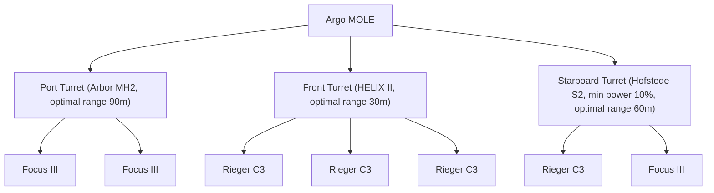

# 1. Base Setup (PD 45, Passive)

This guide is not intended to present an overpowered or "meta" setup, but rather to share practical, experience-based recommendations for configuring your Argo MOLE. It serves as a quick start for newcomers entering MOLE mining—whether solo, in a group, or as part of a multi-ship operation—and also shares insights and new perspectives for seasoned veterans looking to improve or adapt their favorite setups. The focus is on convenience, efficiency, and real-world usability, providing a primer on the key dynamics, critical attributes, and how they affect gameplay. While this setup uses only passive modules, it is not meant to be static or unchanging; instead, it offers a foundation for learning, adapting as you gain experience, and finding your own mining style. Setups with active modules will be discussed separately. The following advice helps you prepare your MOLE for mining operations, supporting informed choices for your playstyle and crew.

---

## 1.1 Turret Loadout Overview

Recommended mining head and module configurations for each turret, with roles and synergy explained for efficient mining.

Below you’ll find a breakdown of each turret, including the recommended mining head, modules, optimal range, window size, instability, and the ideal rock size for each. This makes it easy to see what each turret is best at and how they work together.

### 1.1.1 Front Turret (Main Break)

**Role:** The front turret is your go-to for breaking the biggest and toughest rocks. Start with this turret when you find a high-resistance or high-mass rock. The [HELIX II](https://finder.cstone.space/ShipMiningHeads1/3bcde69d-3e3a-4f78-b2cb-8189b349e4d2) mining head and three Rieger C3 modules give you the most power possible, making it perfect for the first break. Once the main rock is fractured, the side turrets can take over for further breaking and extraction.

| Attribute     | Value                                 |
|--------------|---------------------------------------:|
| Mining Head  | [HELIX II](https://finder.cstone.space/ShipMiningHeads1/3bcde69d-3e3a-4f78-b2cb-8189b349e4d2)                              |
| Modules      | 3x [Rieger C3](https://finder.cstone.space/ShipMiningMods1/2ceb0de9-105b-434e-a152-8af1fd1660d0)                          |
| Optimal Range|                                    30m |
| Fracture Power |                                   195 |
| Resistance   |                                    70 |
| Instability  |                                   100 |
| Optimal Rate |                                   100 |
| Overcharge Rate |                                   100 |
| Window Size  |                                    58 |
| Shatter Damage |                                   100 |
| Extract Power |                                   100 |
| Clustering   |                                   100 |
| Inert Material Level |                            60 |
| Max Rock Size|                                   ~28 tons |
| Notes        | Highest power, for large/high-resistance rocks |

---

### 1.1.2 Starboard Turret (Sub Break)

**Role:** Use the starboard turret after the main break. It’s great for handling medium-sized pieces that are left after the first fracture. The [Hofstede S2](https://finder.cstone.space/ShipMiningHeads1/b422bcf8-b553-4b09-b2be-e92ab2f80e9a) head, with a Rieger C3 and [Focus III](https://finder.cstone.space/ShipMiningMods1/91417d7d-a6ad-4ce2-9d57-1ae15a7486f9) module, gives you a good mix of power and control. This makes it easier to break down rocks that are too small for the main turret but too big or unstable for the support turret. It also helps keep the process stable and safe.

| Attribute     | Value                                 |
|--------------|---------------------------------------:|
| Mining Head  | [Hofstede S2](https://finder.cstone.space/ShipMiningHeads1/b422bcf8-b553-4b09-b2be-e92ab2f80e9a)                            |
| Modules      | 1x [Rieger C3](https://finder.cstone.space/ShipMiningMods1/2ceb0de9-105b-434e-a152-8af1fd1660d0), 1x [Focus III](https://finder.cstone.space/ShipMiningMods1/91417d7d-a6ad-4ce2-9d57-1ae15a7486f9)             |
| Optimal Range|                                    60m |
| Fracture Power |                                   119 |
| Resistance   |                                    70 |
| Instability  |                                   110 |
| Optimal Rate |                                   120 |
| Overcharge Rate |                                   100 |
| Window Size  |                                   222 |
| Shatter Damage |                                   100 |
| Extract Power |                                   100 |
| Clustering   |                                   100 |
| Inert Material Level |                            60 |
| Max Rock Size|                                   ~16 tons |
| Notes        | Versatile, balance of power and precision |

---

### 1.1.3 Port Turret (Support & Extraction)

**Role:** The port turret shines in the final stages of mining. Use it to break down small fragments, help stabilize rocks with high instability, and assist with extraction. The Arbor MH2 head and two [Focus III](https://finder.cstone.space/ShipMiningMods1/91417d7d-a6ad-4ce2-9d57-1ae15a7486f9) modules give you a huge optimal window and help keep things steady, making it perfect for delicate or unstable rocks and for fine-tuning the last part of the fracture.

| Attribute     | Value                                 |
|--------------|---------------------------------------:|
| Mining Head  | [Arbor MH2](https://finder.cstone.space/ShipMiningHeads1/4435898e-a6cc-4f51-ab2a-805d0cf1a44a)                              |
| Modules      | 2x [Focus III](https://finder.cstone.space/ShipMiningMods1/91417d7d-a6ad-4ce2-9d57-1ae15a7486f9)                           |
| Optimal Range|                                    90m |
| Fracture Power |                                    90 |
| Resistance   |                                   125 |
| Instability  |                                    65 |
| Optimal Rate |                                   100 |
| Overcharge Rate |                                   100 |
| Window Size  |                                   274% |
| Shatter Damage |                                   100 |
| Extract Power |                                   100 |
| Clustering   |                                   100 |
| Inert Material Level |                            60 |
| Max Rock Size|                                   ~6 tons |
| Notes        | Long-range, large window, best for support/extraction and small rocks |

---

---

## 1.2 Gadgets

Mining gadgets modify rock properties to make mining easier, safer, or more profitable. The most useful gadgets for the MOLE are compared below.

Mining gadgets are handheld devices that attach directly to a rock, temporarily modifying its properties to make mining easier, safer, or more profitable. After placing and calibrating a gadget, its effects last until the rock is fractured. Below are two gadgets especially useful for MOLE mining:

| Gadget   | Manufacturer         | Optimal Charge Window | Resistance | Instability | Cluster Modifier | When to Use |
|----------|----------------------|----------------------|------------|-------------|------------------|-------------|
| **[Sabir](https://finder.cstone.space/FPSMiningMods1/d539a485-4a68-4426-8678-2cff115e6051)**   | Shubin Interstellar   | +50%                 | -50%       | +15%        | —                | For high-resistance rocks that are difficult to break. Greatly lowers resistance and increases the optimal window, but increases instability. Best for stubborn rocks, but requires careful power management. |
| **[OptiMax](https://finder.cstone.space/FPSMiningMods1/1a6b9b13-d3f8-4f32-b7db-146b90aad2da)** | Greycat Industrial    | -30%                 | -30%       | —           | +60%             | For maximizing yield and keeping valuable fragments together. Reduces resistance but shrinks the optimal window, so use when you want to minimize resource loss and can manage a smaller window. |

**How to Use Mining Gadgets:**
1. Exit your ship and approach the target rock.
2. Attach the gadget to the rock and follow the on-screen prompts to calibrate it.
3. Activate the gadget. Its effects will apply until the rock is fractured.
4. After fracturing, retrieve the gadget for reuse.

---

## 1.3 Optimal Range & Alignment

Matching mining head ranges to turret positions maximizes efficiency and minimizes ship movement during mining.

Each mining head has its own sweet spot for range. Since the MOLE has one front and two side turrets further back, it’s important to set up your mining heads so all three can work at their best without having to move the ship around too much. This keeps your operation smooth, efficient, and safe for everyone on board.

**Example from this Base Setup:**
- The [HELIX II](https://finder.cstone.space/ShipMiningHeads1/3bcde69d-3e3a-4f78-b2cb-8189b349e4d2), with its 30m optimal range, is placed on the front turret.
- The [Hofstede S2](https://finder.cstone.space/ShipMiningHeads1/b422bcf8-b553-4b09-b2be-e92ab2f80e9a), with its 60m optimal range, is on the starboard turret.

This arrangement means that, when the MOLE is parked at the recommended ping distance, the two most powerful lasers have their optimal ranges focused on the same spot. Both turrets can work together efficiently on the same rock while the ship remains stationary, maximizing mining power and minimizing the need for repositioning.

---

## 1.4 Ping Distance (PD)

Position your MOLE at the ideal distance from a rock to ensure all turrets operate within their optimal range for safe and effective mining.

Ping distance (PD) is the ideal distance to park your MOLE from a rock before you start mining. Keeping a consistent PD means your lasers are always in their best range, making mining easier and safer. It also helps all turrets reach the rock without moving the ship, reduces the risk of bumping into things, and makes teamwork easier.

### 1.4.1 How to Approach to Ping Distance (PD)

1. **Ping with your radar:** Use your ship’s radar to display the rock's distance.
2. **Approach to your setup’s ping distance (PD):** For this setup, fly in and stop about 45 meters from the rock. If you use a different setup, adjust your distance as needed.
3. **Raise the nose:** Gently lift the nose of your MOLE until the rock just disappears behind the dashboard. This helps all turrets get a clear shot and stay in their optimal range.

Follow these steps to hit the ideal PD every time for safe and efficient mining.

---

## 1.5 Coordinated Multi-Turret Operation

In a single ship Multi-Crew operation, the most efficient crew count is **3**. This setup allows the MOLE to remain stationary during mining, ensuring that all turrets can be used without the need for constant ship repositioning. With three crew members, each can operate a turret, and the pilot is always engaged—no one is left idle or "bored to death" while others fracture rocks. This also optimizes the dividends of the operation, as there are fewer people to share the profits with, maximizing individual earnings.

Best practices for using all three MOLE turrets together, solo or with a full crew, to maximize safety and yield.

While you can use this setup solo, it really shines with a full three-person crew. Here’s how to get the most out of all three turrets working together.

### 1.5.1 Crew Roles and Initial Setup
- **Pilot:** After getting the MOLE to the right ping distance, the pilot moves to the front (Main Break) turret.
- **Port Turret Operator:** Takes the Support & Extraction turret.
- **Starboard Turret Operator:** Takes the Sub Break turret.

### 1.5.2 Synchronized Fracturing Sequence
1. **Apply Support Bonuses:**
   - The port turret operator starts by turning on their mining laser in fracture mode at minimal power, aiming at the rock. This applies the [Arbor MH2](https://finder.cstone.space/ShipMiningHeads1/4435898e-a6cc-4f51-ab2a-805d0cf1a44a) and [Focus III](https://finder.cstone.space/ShipMiningMods1/91417d7d-a6ad-4ce2-9d57-1ae15a7486f9) bonuses, making the rock more stable and the optimal window much bigger. The front and starboard turrets stay off for now.
2. **Layer Additional Modifiers:**
   - Next, the starboard turret operator turns on their mining laser at minimal power. This adds more window and stability bonuses from the [Focus III](https://finder.cstone.space/ShipMiningMods1/91417d7d-a6ad-4ce2-9d57-1ae15a7486f9) module, making the rock even easier to manage.
3. **Initiate Main Fracture:**
   - The front turret operator slowly increases power, looking for a stable charge where the gauge just barely drops (about 50–75% toward optimal). The port and starboard turrets keep their bonuses going at minimal power.
4. **Synchronize Power Application:**
   - Once the front turret is stable, the starboard turret operator brings their charge up close to the optimal window, finding a spot where the charge stays steady and near optimal.
5. **Precision Fracture and Extraction:**
   - As the rock gets close to the optimal window, the port turret operator fine-tunes their power to control the final break.

**Critical Note on Overcharge:**
- If the charge gauge goes into overcharge, the port and starboard turrets must stay on. Turning them off suddenly while the front turret is still firing will make the charge spike even more, risking a blowout. The front turret operator is the emergency brake—if overcharge is about to happen, they must turn off their laser immediately. This keeps the operation safe and under control.

This teamwork-focused approach keeps even tough rocks stable, and makes mining safer and more efficient. Good communication and watching the fracture gauge are key for everyone involved.

---

## 1.6 Solo MOLE Operation

Solo MOLE mining is possible and effective with the right approach, even though the ship is designed for a crew. Knowing your equipment and matching your turret choice to the rock's mass is key to efficient solo mining with the base setup:

- **Turret Selection by Rock Mass and Pilot Movement:**
  - The pilot should move between turrets based on the rock size:
    - For rocks **over 15,000 kg**, start in the **front (Main Break) turret**.
    - For rocks **over 5,000 kg but 15,000 kg or less**, move to the **starboard (Sub Break) turret**.
    - For rocks **5,000 kg or less**, move to the **port (Support & Extraction) turret**.
  - To avoid unnecessary marching around the ship, ensure all the rocks you intend to break are below the next turret's threshold mass before swapping turrets. This minimizes seat changes and streamlines your workflow.
  - This approach ensures you always use the most effective mining head and modules for the rock size, maximizing efficiency and safety.
- **[Sabir](https://finder.cstone.space/FPSMiningMods1/d539a485-4a68-4426-8678-2cff115e6051)** Gadget for Large Rocks:
  - For rocks **over 28,000 kg**, exit the ship and apply a **[Sabir](https://finder.cstone.space/FPSMiningMods1/d539a485-4a68-4426-8678-2cff115e6051)** gadget to the rock before fracturing with the front turret. This greatly lowers resistance and increases the optimal window, making the break possible.

Solo MOLE mining is slower than with a full crew, but with careful planning and the right setup, it’s a rewarding and profitable way to mine.

---

