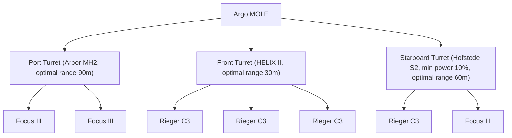

[💬 Send feedback on this page](https://github.com/codepic/StarCitizen.Mining.Mole/issues/new?template=feedback.yml&title=Feedback+on+BaseSetup.md&page=BaseSetup.md)  

# 1. Base Setup (PD 45, Passive)

This guide is not intended to present an overpowered or "meta" setup, but rather to share practical, experience-based recommendations for configuring your Argo MOLE. It serves as a quick start for newcomers entering MOLE mining—whether solo, in a group, or as part of a multi-ship operation—and also shares insights and new perspectives for seasoned veterans looking to improve or adapt their favorite setups. The focus is on convenience, efficiency, and real-world usability, providing a primer on the key dynamics, critical attributes, and how they affect gameplay. While this setup uses only passive modules, it is not meant to be static or unchanging; instead, it offers a foundation for learning, adapting as you gain experience, and finding your own mining style. Setups with active modules will be discussed separately. The following advice helps you prepare your MOLE for mining operations, supporting informed choices for your playstyle and crew.

---

## 1.1 Turret Loadout Overview

Recommended mining head and module configurations for each turret, with roles and synergy explained for efficient mining.

### 1.1.0 Regolith's Mining Loadouts

- [Base Setup (no gadgets)](images/Regolith-loadout-MOLE-Base%20Setup%20(no%20gadgets).png)
- [Base Setup (Sabir)](images/Regolith-loadout-MOLE-Base%20Setup%20(Sabir).png)
- [Base Setup (OptiMax)](images/Regolith-loadout-MOLE-Base%20Setup%20(OptiMax).png)

Below you’ll find a breakdown of each turret, including the recommended mining head, modules, optimal range, window size, instability, and the ideal rock size for each. This makes it easy to see what each turret is best at and how they work together.

### 1.1.1 Front Turret (Main Break)

> **Vehicle Loadout Manager**: Turret Weapon Slot 1

**Role:** The front turret is your go-to for breaking the biggest and toughest rocks. Start with this turret when you find a high-resistance or high-mass rock. The [HELIX II](https://finder.cstone.space/ShipMiningHeads1/3bcde69d-3e3a-4f78-b2cb-8189b349e4d2) mining head and three [Rieger C3](https://finder.cstone.space/ShipMiningMods1/2ceb0de9-105b-434e-a152-8af1fd1660d0) modules give you the most power possible, making it perfect for the first break. Once the main rock is fractured, the side turrets can take over for further breaking and extraction.

| Attribute     | Value                                 |
|--------------|---------------------------------------:|
| Mining Head  | [HELIX II](https://finder.cstone.space/ShipMiningHeads1/3bcde69d-3e3a-4f78-b2cb-8189b349e4d2)                              |
| Modules      | 3x [Rieger C3](https://finder.cstone.space/ShipMiningMods1/2ceb0de9-105b-434e-a152-8af1fd1660d0)                          |
| Optimal Range|                                    30m |
| Fracture Power |                                   195 |
| Resistance   |                                    70 |
| Instability  |                                   100 |
| Optimal Rate |                                   100 |
| Overcharge Rate |                                   100 |
| Window Size  |                                    58 |
| Shatter Damage |                                   100 |
| Extract Power |                                   100 |
| Clustering   |                                   100 |
| Inert Material Level |                            60 |
| Max Rock Size|                                   ~32 tons |
| Notes        | Highest power, for large/high-resistance rocks |

#### 1.1.1.1 Why Helix II Is the Best Choice for Main Break

When choosing a mining laser for the MOLE's main break turret, the Helix II stands out for several reasons:

- **Maximum Fracture Power:** The Helix II offers the highest minimum and maximum power output among all size 2 mining lasers, making it ideal for breaking the largest and most resistant rocks. This is critical for the main break role, where raw power is needed to initiate fractures on high-mass nodes.
- **Resistance Reduction:** With a -30 resistance modifier, the Helix II makes rocks easier to break by reducing their effective resistance. This is especially valuable when dealing with high-resistance deposits that would otherwise be difficult or impossible to fracture with weaker lasers.
- **Instability Management:** While the Helix II does not reduce instability (0 modifier), its high power and resistance reduction more than compensate, especially when paired with Rieger C3 modules that further boost power and control.
- **Slot Count:** The Helix II supports three module slots, allowing for maximum customization and synergy. This enables you to stack power or add stability/control modules as needed for the toughest rocks.
- **Optimal Range and Window:** Although its optimal range (30m) and window (-40) are not the highest, these are less critical for the main break role, where power and resistance reduction take priority over fine control.

Compared to other options:
- The Lancet MH2 and Arbor MH2 offer better instability reduction and optimal window, but lack the raw power and resistance reduction needed for the initial break.
- The Klein-S2 and Impact II have less power and fewer module slots, making them less effective for the toughest rocks.
- The Hofstede-S2 is more specialized for stability and control, better suited for secondary or support roles.

**Summary:** The Helix II is the best choice for the main break turret because it delivers unmatched power and resistance reduction, enabling you to tackle the largest and most challenging rocks with confidence. Its three module slots further enhance its versatility and effectiveness in this critical role.

##### 1.1.1.2 Note on Helix II's Optimal Window Pitfall

The main drawback of the Helix II is its significant reduction to the optimal charge window ("Optimal Window"). This makes it harder to keep the energy level within the safe zone during fracturing, especially for less experienced pilots or when operating solo. However, in a multi-turret crew, this weakness is more than compensated by the Port turret, which is equipped with the Arbor MH2 head and Focus III modules—both of which dramatically increase the optimal window and stability. This synergy allows the team to leverage the Helix II's raw power without being overly penalized by its narrow optimal window.

For solo pilots, or in situations where you need extra help with the optimal window, mining gadgets can be used to compensate for this pitfall. Gadgets like the Okunis, Sabir, or WaveShift can increase the size and fill speed of the optimal charge window or improve stability, making the mining process much more forgiving. To learn more about mining gadgets and their effects, see [finder.cstone.space: Mining Gadgets](https://finder.cstone.space/FPSMiningMods).

---

### 1.1.2 Starboard Turret (Sub Break)

> **Vehicle Loadout Manager**: Turret Weapon Slot 3

**Role:** Use the starboard turret after the main break. It’s great for handling medium-sized pieces that are left after the first fracture. The [Hofstede S2](https://finder.cstone.space/ShipMiningHeads1/b422bcf8-b553-4b09-b2be-e92ab2f80e9a) head, with a [Rieger C3](https://finder.cstone.space/ShipMiningMods1/2ceb0de9-105b-434e-a152-8af1fd1660d0) and [Focus III](https://finder.cstone.space/ShipMiningMods1/91417d7d-a6ad-4ce2-9d57-1ae15a7486f9) module, gives you a good mix of power and control. This makes it easier to break down rocks that are too small for the main turret but too big or unstable for the support turret. It also helps keep the process stable and safe.

| Attribute     | Value                                 |
|--------------|---------------------------------------:|
| Mining Head  | [Hofstede S2](https://finder.cstone.space/ShipMiningHeads1/b422bcf8-b553-4b09-b2be-e92ab2f80e9a)                            |
| Modules      | 1x [Rieger C3](https://finder.cstone.space/ShipMiningMods1/2ceb0de9-105b-434e-a152-8af1fd1660d0), 1x [Focus III](https://finder.cstone.space/ShipMiningMods1/91417d7d-a6ad-4ce2-9d57-1ae15a7486f9)             |
| Optimal Range|                                    60m |
| Fracture Power |                                   119 |
| Resistance   |                                    70 |
| Instability  |                                   110 |
| Optimal Rate |                                   120 |
| Overcharge Rate |                                   100 |
| Window Size  |                                   222 |
| Shatter Damage |                                   100 |
| Extract Power |                                   100 |
| Clustering   |                                   100 |
| Inert Material Level |                            60 |
| Max Rock Size|                                   ~16 tons |
| Notes        | Versatile, balance of power and precision |

#### 1.1.2.1 Why Hofstede S2 Is the Best Choice for Sub Break

The Hofstede S2 is an excellent choice for the starboard (sub break) turret due to its unique balance of attributes:

- **Resistance Reduction:** With a -30 resistance modifier, the Hofstede S2 makes rocks easier to break, similar to the Helix II, but with less raw power. This is ideal for medium-sized fragments that remain after the main break, where resistance is still a factor but extreme power is not required.
- **Large Optimal Window:** The Hofstede S2 offers a significant +60 to the optimal window, the highest among all size 2 mining lasers. This makes it much easier to keep the energy level within the safe zone, reducing the risk of overcharging and making the process more forgiving—especially important when handling rocks that are smaller or more unstable after the initial fracture.
- **Balanced Instability:** While it adds a small amount of instability (+10), this is easily managed with the right module combination (such as Focus III), and is a worthwhile tradeoff for the much larger optimal window.
- **Good Range and Power:** Its optimal range (60m) and power output are well-suited for the sub break role, providing enough reach and control for most post-fracture scenarios.
- **Module Flexibility:** With two module slots, you can tailor the turret for either more power or more control, depending on the specific needs of the rock you are working on.

Compared to other options:
- The Helix II is overkill for this role, with too much power and a much smaller optimal window, making it harder to control on smaller rocks.
- The Lancet MH2 and Arbor MH2 offer better instability reduction, but lack the resistance reduction and optimal window size that make the Hofstede S2 so versatile for sub breaking.
- The Klein-S2 and Impact II have less resistance reduction and smaller optimal windows, making them less forgiving and less effective for this stage of mining.

**Summary:** The Hofstede S2 is the best choice for the sub break turret because it combines strong resistance reduction with the largest optimal window available, making it easy to control and highly effective for breaking down medium-sized fragments after the main break. Its forgiving handling and flexibility make it a favorite for this critical role.

##### 1.1.2.2 Note on Hofstede S2's Power Limitation

The main limitation of the Hofstede S2 is its relatively low maximum power output compared to other mining lasers. This means it can struggle with the hardest or most resistant rocks, especially when operating solo. In a multi-turret crew, this is not an issue—the main (Helix II) turret provides more than enough power for the initial break, allowing the Hofstede S2 to focus on precision and control for subsequent fractures.

For solo pilots, there are a few ways to address this pitfall. You can use mining gadgets that reduce rock resistance (such as the Sabir) or increase the optimal window (like Okunis or WaveShift) to make tough rocks more manageable. See [finder.cstone.space: Mining Gadgets](https://finder.cstone.space/FPSMiningMods) for a full list of options and their effects. Alternatively, you can simply switch to the main break turret for the hardest rocks, then return to the Hofstede S2 for the rest of the process.

A key advantage of the Hofstede S2 is that, thanks to its forgiving handling and large optimal window and power range, many rocks can be mined from start to finish without ever needing to switch turrets. This makes it an excellent all-rounder and a favorite for solo pilots who value simplicity and control.

---

### 1.1.3 Port Turret (Support & Extraction)

> **Vehicle Loadout Manager**: Turret Weapon Slot 2

**Role:** The port turret shines in the final stages of mining. Use it to break down small fragments, help stabilize rocks with high instability, and assist with extraction. The Arbor MH2 head and two [Focus III](https://finder.cstone.space/ShipMiningMods1/91417d7d-a6ad-4ce2-9d57-1ae15a7486f9) modules give you a huge optimal window and help keep things steady, making it perfect for delicate or unstable rocks and for fine-tuning the last part of the fracture.

| Attribute     | Value                                 |
|--------------|---------------------------------------:|
| Mining Head  | [Arbor MH2](https://finder.cstone.space/ShipMiningHeads1/4435898e-a6cc-4f51-ab2a-805d0cf1a44a)                              |
| Modules      | 2x [Focus III](https://finder.cstone.space/ShipMiningMods1/91417d7d-a6ad-4ce2-9d57-1ae15a7486f9)                           |
| Optimal Range|                                    90m |
| Fracture Power |                                    90 |
| Resistance   |                                   125 |
| Instability  |                                    65 |
| Optimal Rate |                                   100 |
| Overcharge Rate |                                   100 |
| Window Size  |                                   274% |
| Shatter Damage |                                   100 |
| Extract Power |                                   100 |
| Clustering   |                                   100 |
| Inert Material Level |                            60 |
| Max Rock Size|                                   ~6 tons |
| Notes        | Long-range, large window, best for support/extraction and small rocks |

#### 1.1.3.1 Why Arbor MH2 Is the Best Choice for Support & Extraction

The Arbor MH2 is an outstanding choice for the port (support & extraction) turret due to its unique combination of attributes:

- **Exceptional Instability Reduction:** With a -35 instability modifier, the Arbor MH2 is the best among all size 2 mining lasers for stabilizing rocks. This makes it ideal for handling small, unstable fragments and for assisting with extraction, where control is more important than raw power.
- **Longest Optimal and Minimum Range:** The Arbor MH2 offers the longest optimal range (270m) and minimum range (90m) of any size 2 mining laser, giving the operator maximum flexibility in positioning and approach, especially when working with scattered fragments.
- **Generous Optimal Window:** Its +40 optimal window modifier makes it much easier to keep the energy level within the safe zone, reducing the risk of overcharging and making the process more forgiving—especially important for delicate or unstable rocks.
- **Low Power Output:** While its maximum power is the lowest among the options, this is actually a benefit for the support/extraction role, as it allows for fine control and minimizes the risk of accidental over-fracturing or shattering valuable fragments.
- **Module Flexibility:** With two module slots, you can further enhance stability or add control modules to tailor the turret for the most challenging extraction scenarios.

Compared to other options:
- The Helix II and Hofstede S2 offer more power and resistance reduction, but lack the extreme stability and control needed for the final stages of mining.
- The Lancet MH2 is also good for instability reduction, but does not offer the same optimal window or range as the Arbor MH2.
- The Klein-S2 and Impact II have less stability and smaller optimal windows, making them less effective for support and extraction.

**Summary:** The Arbor MH2 is the best choice for the support/extraction turret because it delivers unmatched stability, a forgiving optimal window, and precise control—exactly what is needed for breaking down small fragments and assisting with extraction. Its attributes make the final stages of mining safer, easier, and more efficient for both solo and crewed operations.

> **Fun Fact:** The Arbor MH2's generous optimal window is so forgiving, you might find yourself nodding off at the controls. With so little risk of the rock blowing up in your face, mining becomes less of a white-knuckle thrill ride and more of a relaxing, sleep-inducing pastime. If you crave excitement, you might want to look elsewhere—or just try mining with your monitor turned off for a real challenge!

##### 1.1.3.2 Note on Arbor MH2's Power (and Unsung Brilliance)

The Arbor MH2 isn’t going to make rocks any easier to crack—its power output is, frankly, modest at best. But here’s where things get interesting: with a 274% optimal window, that rock with a hair-thin safe zone, ready to blow at the slightest mistake, suddenly becomes a breeze to break. You won’t be shattering records for brute force, but you’ll be calmly guiding the fracture bar through a window so wide, you might wonder if the rock even remembers what danger felt like. Sometimes, the quietest tools make the loudest difference.

---

## 1.2 Inert Filtering & Extraction Laser Bonus

Inert filtering is a key feature of MOLE mining turrets and modules, allowing you to reduce the impact of inert (waste) material when extracting ore. Most MOLE turret setups with Focus III modules or similar extraction bonuses will apply a multiplier to inert content, typically reducing it to 60% of its original value (i.e., a **0.6 multiplier for inerts**). This means that when calculating the value of a rock, you only count 60% of the reported inert proportion, reflecting the improved efficiency of your extraction setup.

**Example:**
- If a rock contains 33% Bexalite (A-tier) and 67% inert material, the adjusted inert is 67% × 0.6 = 40%.
- Add 33% Bexalite + 40% Adjusted Inert = 73% total.
- The proportion of Bexalite in the adjusted total: 33% / 73% ≈ 45%.
- So, your initial 33% Bexalite is effectively 45% of the valuable content, making it worth mining.

> **Note:** The actual inert filtering multiplier may vary depending on your specific turret/module setup. Check your current loadout for the exact value.

---

## 1.3 Gadgets

Mining gadgets modify rock properties to make mining easier, safer, or more profitable. The most useful gadgets for the MOLE are compared below.

Mining gadgets are handheld devices that attach directly to a rock, temporarily modifying its properties to make mining easier, safer, or more profitable. After placing and calibrating a gadget, its effects last until the rock is fractured. Below are two gadgets especially useful for MOLE mining:

| Gadget   | Manufacturer         | Optimal Charge Window | Resistance | Instability | Cluster Modifier | When to Use |
|----------|----------------------|----------------------|------------|-------------|------------------|-------------|
| **[Sabir](https://finder.cstone.space/FPSMiningMods1/d539a485-4a68-4426-8678-2cff115e6051)**   | Shubin Interstellar   | +50%                 | -50%       | +15%        | —                | For high-resistance rocks that are difficult to break. Greatly lowers resistance and increases the optimal window, but increases instability. Best for stubborn rocks, but requires careful power management. |
| **[OptiMax](https://finder.cstone.space/FPSMiningMods1/1a6b9b13-d3f8-4f32-b7db-146b90aad2da)** | Greycat Industrial    | -30%                 | -30%       | —           | +60%             | For maximizing yield and keeping valuable fragments together. Reduces resistance but shrinks the optimal window, so use when you want to minimize resource loss and can manage a smaller window. |

**How to Use Mining Gadgets:**
1. Exit your ship and approach the target rock.
2. Attach the gadget to the rock and follow the on-screen prompts to calibrate it.
3. Activate the gadget. Its effects will apply until the rock is fractured.
4. After fracturing, retrieve the gadget for reuse.

---

## 1.4 Optimal Range & Alignment

Matching mining head ranges to turret positions maximizes efficiency and minimizes ship movement during mining.

Each mining head has its own sweet spot for range. Since the MOLE has one front and two side turrets further back, it’s important to set up your mining heads so all three can work at their best without having to move the ship around too much. This keeps your operation smooth, efficient, and safe for everyone on board.

**Example from this Base Setup:**
- The [HELIX II](https://finder.cstone.space/ShipMiningHeads1/3bcde69d-3e3a-4f78-b2cb-8189b349e4d2), with its 30m optimal range, is placed on the front turret.
- The [Hofstede S2](https://finder.cstone.space/ShipMiningHeads1/b422bcf8-b553-4b09-b2be-e92ab2f80e9a), with its 60m optimal range, is on the starboard turret.

This arrangement means that, when the MOLE is parked at the recommended ping distance, the two most powerful lasers have their optimal ranges focused on the same spot. Both turrets can work together efficiently on the same rock while the ship remains stationary, maximizing mining power and minimizing the need for repositioning.

---

## 1.5 Ping Distance (PD)

Position your MOLE at the ideal distance from a rock to ensure all turrets operate within their optimal range for safe and effective mining.

Ping distance (PD) is the ideal distance to park your MOLE from a rock before you start mining. Keeping a consistent PD means your lasers are always in their best range, making mining easier and safer. It also helps all turrets reach the rock without moving the ship, reduces the risk of bumping into things, and makes teamwork easier.

### 1.5.1 How to Approach to Ping Distance (PD)

1. **Ping with your radar:** Use your ship’s radar to display the rock's distance.
2. **Approach to your setup’s ping distance (PD):** For this setup, fly in and stop about 45 meters from the rock. If you use a different setup, adjust your distance as needed.
3. **Raise the nose:** Gently lift the nose of your MOLE until the rock just disappears behind the dashboard. This helps all turrets get a clear shot and stay in their optimal range.

Follow these steps to hit the ideal PD every time for safe and efficient mining.

---

## 1.6 Coordinated Multi-Turret Operation

In a single ship Multi-Crew operation, the most efficient crew count is **3**. This setup allows the MOLE to remain stationary during mining, ensuring that all turrets can be used without the need for constant ship repositioning. With three crew members, each can operate a turret, and the pilot is always engaged—no one is left idle or "bored to death" while others fracture rocks. This also optimizes the dividends of the operation, as there are fewer people to share the profits with, maximizing individual earnings.

Best practices for using all three MOLE turrets together, solo or with a full crew, to maximize safety and yield.

While you can use this setup solo, it really shines with a full three-person crew. Here’s how to get the most out of all three turrets working together.

### 1.6.1 Crew Roles and Initial Setup
- **Pilot:** After getting the MOLE to the right ping distance, the pilot moves to the front (Main Break) turret.
- **Port Turret Operator:** Takes the Support & Extraction turret.
- **Starboard Turret Operator:** Takes the Sub Break turret.

### 1.6.2 Synchronized Fracturing Sequence
1. **Apply Support Bonuses:**
   - The port turret operator starts by turning on their mining laser in fracture mode at minimal power, aiming at the rock. This applies the [Arbor MH2](https://finder.cstone.space/ShipMiningHeads1/4435898e-a6cc-4f51-ab2a-805d0cf1a44a) and [Focus III](https://finder.cstone.space/ShipMiningMods1/91417d7d-a6ad-4ce2-9d57-1ae15a7486f9) bonuses, making the rock more stable and the optimal window much bigger. The front and starboard turrets stay off for now.
2. **Layer Additional Modifiers:**
   - Next, the starboard turret operator turns on their mining laser at minimal power. This adds more window and stability bonuses from the [Focus III](https://finder.cstone.space/ShipMiningMods1/91417d7d-a6ad-4ce2-9d57-1ae15a7486f9) module, making the rock even easier to manage.
3. **Initiate Main Fracture:**
   - The front turret operator slowly increases power, looking for a stable charge where the gauge just barely drops (about 50–75% toward optimal). The port and starboard turrets keep their bonuses going at minimal power.
4. **Synchronize Power Application:**
   - Once the front turret is stable, the starboard turret operator brings their charge up close to the optimal window, finding a spot where the charge stays steady and near optimal.
5. **Precision Fracture and Extraction:**
   - As the rock gets close to the optimal window, the port turret operator fine-tunes their power to control the final break.

**Critical Note on Overcharge:**
- If the charge gauge goes into overcharge, the port and starboard turrets must stay on. Turning them off suddenly while the front turret is still firing will make the charge spike even more, risking a blowout. The front turret operator is the emergency brake—if overcharge is about to happen, they must turn off their laser immediately. This keeps the operation safe and under control.

This teamwork-focused approach keeps even tough rocks stable, and makes mining safer and more efficient. Good communication and watching the fracture gauge are key for everyone involved.

---

## 1.7 Solo MOLE Operation

Solo MOLE mining is possible and effective with the right approach, even though the ship is designed for a crew. Knowing your equipment and matching your turret choice to the rock's mass is key to efficient solo mining with the base setup:

- **Turret Selection by Rock Mass and Pilot Movement:**
  - The pilot should move between turrets based on the rock size:
    - For rocks **over 15,000 kg**, start in the **front (Main Break) turret**.
    - For rocks **over 5,000 kg but 15,000 kg or less**, move to the **starboard (Sub Break) turret**.
    - For rocks **5,000 kg or less**, move to the **port (Support & Extraction) turret**.
  - To avoid unnecessary marching around the ship, ensure all the rocks you intend to break are below the next turret's threshold mass before swapping turrets. This minimizes seat changes and streamlines your workflow.
  - This approach ensures you always use the most effective mining head and modules for the rock size, maximizing efficiency and safety.
- **[Sabir](https://finder.cstone.space/FPSMiningMods1/d539a485-4a68-4426-8678-2cff115e6051)** Gadget for Large Rocks:
  - For rocks **over 28,000 kg**, exit the ship and apply a **[Sabir](https://finder.cstone.space/FPSMiningMods1/d539a485-4a68-4426-8678-2cff115e6051)** gadget to the rock before fracturing with the front turret. This greatly lowers resistance and increases the optimal window, making the break possible.

Solo MOLE mining is slower than with a full crew, but with careful planning and the right setup, it’s a rewarding and profitable way to mine.

---

## 1.8 References & Further Reading

- Regolith Rocks Ore Survey: https://regolith.rocks/survey/ores
- Finder.cstone.space Mining Heads: https://finder.cstone.space/ShipMiningHeads1/3bcde69d-3e3a-4f78-b2cb-8189b349e4d2
- Finder.cstone.space Mining Gadgets: https://finder.cstone.space/FPSMiningMods
- Finder.cstone.space Helix II: https://finder.cstone.space/ShipMiningHeads1/3bcde69d-3e3a-4f78-b2cb-8189b349e4d2
- Finder.cstone.space Hofstede S2: https://finder.cstone.space/ShipMiningHeads1/b422bcf8-b553-4b09-b2be-e92ab2f80e9a
- Finder.cstone.space Arbor MH2: https://finder.cstone.space/ShipMiningHeads1/4435898e-a6cc-4f51-ab2a-805d0cf1a44a
- Finder.cstone.space Rieger C3: https://finder.cstone.space/ShipMiningMods1/2ceb0de9-105b-434e-a152-8af1fd1660d0
- Finder.cstone.space Focus III: https://finder.cstone.space/ShipMiningMods1/91417d7d-a6ad-4ce2-9d57-1ae15a7486f9
- Finder.cstone.space Sabir: https://finder.cstone.space/FPSMiningMods1/d539a485-4a68-4426-8678-2cff115e6051
- Finder.cstone.space OptiMax: https://finder.cstone.space/FPSMiningMods1/1a6b9b13-d3f8-4f32-b7db-146b90aad2da

---

## 1.9 Related Guides

- For mining location strategies and ore property tables, see [Mining Location Selection](MiningLocation.md)
- For radar mechanics, detection formulas, and scanning tips, see [Radar Mechanics and Resource Detection](RadarMechanics.md)
- For practical scanning steps and resource identification, see [Scanning for Resources](ResourceScanning.md)
- For ore cutoff policies and evaluation math, see [Ore Cutoff Percentages & Rock Evaluation](OreCutoff.md)
