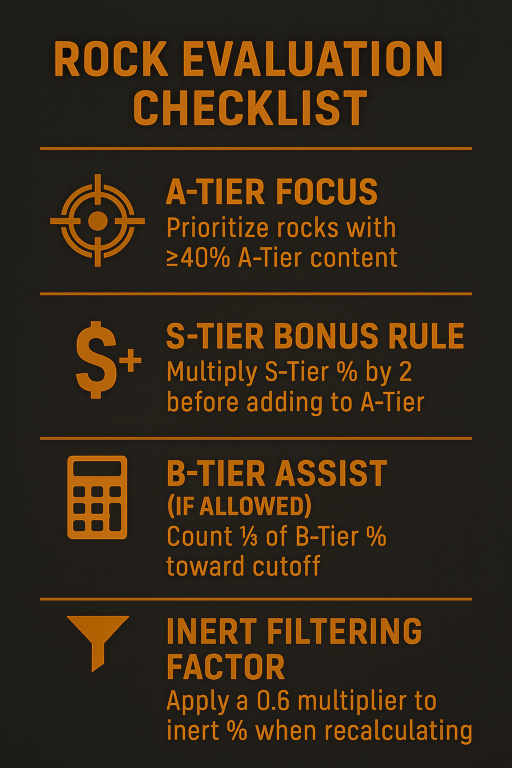

[💬 Send feedback on this page](https://github.com/codepic/StarCitizen.Mining.Mole/issues/new?template=feedback.yml&title=Feedback+on+OreCutoff.md&page=OreCutoff.md)  

# 5. Ore Cutoff Percentages & Rock Evaluation

*Background:*
Many times, I've tried to set myself a strict cutoff before going mining—only to realize that, in practice, I end up breaking my own "promise" here and there. This document was born from analyzing the factors that cause me (and likely others) to steer away from a predefined A-tier cutoff. By understanding these factors, we can treat a predefined cutoff not as a rigid rule, but as a dynamic target. This approach lets us adapt our decisions to the actual rock compositions we encounter, while still aiming for a consistent, reliable financial outcome over time.

> **Note:** While this document describes calculations you can make in the field, it's not intended that everyone mines with a calculator or spreadsheet in hand. Remember to have fun, relax, and review your decision-making process. At first, you might take a more rigid approach to mining decisions, but soon enough it should become a natural habit—knowing your choices are grounded in deterministic science and math, not just whim or guesswork. But if you do, we won’t judge. Much.

---

## 5.1 Why Use a Single Cutoff Number?

Communicating your mining target as a single cutoff percentage—supported by a few clear rules—offers powerful benefits for both solo and group mining:

- **Simplicity:** Everyone knows the baseline for what to mine. No need to debate every rock; the number is clear.
- **Consistency:** Decisions are repeatable and reliable, leading to steady profits and less second-guessing.
- **Adaptability:** The cutoff can be quickly adjusted by the pilot or organizer to match changing conditions (e.g., if high-value rocks are rare, lower the cutoff to keep bags full).
- **Team Coordination:** With a single number and shared rules, the whole crew can align their actions, avoid confusion, and maximize efficiency.
- **Confidence:** You can trust your decisions are grounded in logic and math, not just gut feeling—making mining less stressful and more enjoyable.

> **Motivation:**
> This guide will show you how to use a single cutoff value, combined with a few dynamic rules, to make smart, flexible mining decisions. Whether you're new or experienced, this approach will help you get the most out of every mining run—so read on and see how it works in practice!

---

## 5.2 Ore Tiers Explained

Below are the most relevant mining ores, their acronyms, and approximate values (per SCU) as of June 2025. For a full, up-to-date list, see [Regolith Rocks Ore Survey](https://regolith.rocks/survey/ores) and [UEX Corp Commodities](https://uexcorp.space/commodities).

### 5.2.1 S-Tier Ores

| Ore Name   | Acronym | Value (UEC/SCU) |
|------------|---------|-----------------|
| Quantanium | [QUAN](https://uexcorp.space/commodities/info/name/quantanium/tab/locations_buying/)    | 22,000          |
| Stileron   | [STIL](https://uexcorp.space/commodities/info/name/stileron/tab/locations_buying/)    | 28,000          |
| Riccite    | [RICC](https://uexcorp.space/commodities/info/name/riccite/tab/locations_buying/)    | 21,000          |

### 5.2.2 A-Tier Ores

| Ore Name  | Acronym | Value (UEC/SCU) |
|-----------|---------|-----------------|
| Taranite  | [TARA](https://uexcorp.space/commodities/info/name/taranite/tab/locations_buying/)    | 9,000           |
| Bexalite  | [BEXA](https://uexcorp.space/commodities/info/name/bexalite/tab/locations_buying/)    | 7,000           |
| Gold      | [GOLD](https://uexcorp.space/commodities/info/name/gold/tab/locations_buying/)    | 6,000           |

### 5.2.3 B-Tier Ores

| Ore Name      | Acronym | Value (UEC/SCU) |
|---------------|---------|-----------------|
| Laranite      | [LARA](https://uexcorp.space/commodities/info/name/laranite/tab/locations_buying/)    | 3,000           |
| Borase        | [BORA](https://uexcorp.space/commodities/info/name/borase/tab/locations_buying/)    | 3,000           |
| Beryl         | [BERY](https://uexcorp.space/commodities/info/name/beryl/tab/locations_buying/)    | 3,000           |
| Agricium      | [AGRI](https://uexcorp.space/commodities/info/name/agricium/tab/locations_buying/)    | 2,000           |
| Hephaestanite | [HEPH](https://uexcorp.space/commodities/info/name/hephaestanite/tab/locations_buying/)    | 2,000           |

### 5.2.4 C-Tier Ores

| Ore Name   | Acronym | Value (UEC/SCU) |
|------------|---------|-----------------|
| Tungsten   | [TUNG](https://uexcorp.space/commodities/info/name/tungsten/tab/locations_buying/)    | 614             |
| Titanium   | [TITA](https://uexcorp.space/commodities/info/name/titanium/tab/locations_buying/)    | 451             |
| Silicon    | [SILI](https://uexcorp.space/commodities/info/name/silicon/tab/locations_buying/)    | 197             |
| Iron       | [IRON](https://uexcorp.space/commodities/info/name/iron/tab/locations_buying/)    | 372             |
| Quartz     | [QUAR](https://uexcorp.space/commodities/info/name/quartz/tab/locations_buying/)    | 373             |
| Corundum   | [CORU](https://uexcorp.space/commodities/info/name/corundum/tab/locations_buying/)    | 356             |
| Copper     | [COPP](https://uexcorp.space/commodities/info/name/copper/tab/locations_buying/)    | 351             |
| Tin        | [TIN](https://uexcorp.space/commodities/info/name/tin/tab/locations_buying/)    | 319             |
| Aluminum   | [ALUM](https://uexcorp.space/commodities/info/name/aluminum/tab/locations_buying/)    | 296             |
| Ice        | [ICE](https://uexcorp.space/commodities/info/name/pressurized-ice/tab/locations_buying/)    | 100             |

> **Note:** Values are approximate and fluctuate with the in-game market. Acronyms are community-standard.

## 5.3 Practical Cutoff Guidelines

Before diving into the details, let's introduce the concept of an **A-tier focus**. This approach is based on the idea that you can achieve reliable and repeatable results by prioritizing A-tier ores, rather than endlessly hunting for the elusive S-tier "unicorn." Chasing only S-tier rocks might occasionally lead to a big win, but more often you'll come back empty-handed. Focusing on A-tier makes mining more fun and consistent, and when you do find an S-tier rock, it feels like a cherry on top of the cake. Using a single cutoff percentage based on A-tier content helps maximize profit and efficiency, filling your cargo with the most valuable and commonly available ores, while keeping your mining decisions simple and effective. The cutoff percentage and most crew policies in this guide are explained with this A-tier focus in mind, and the following policies (for S-tier, B-tier, or inerts) are adjustments to this default approach.

### 5.3.1 Mission Start: Crew Communication
At the beginning of each mining mission, discuss with your crew or event organizer:
- What the cutoff percentage will be for A-tier ores
- Whether B-tier ores will be refined or discarded
- What the policy is for C-tier ores (normally considered basically inert, contributing fully to waste)
- Each turret operator's inert filtering capabilities

This ensures everyone is aligned on what rocks are worth mining and prevents wasted effort. Some groups may want to target B-tier ores as well as A-tier ores. In these cases, discuss whether B-tier ores should contribute to the cutoff (e.g., at a reduced rate such as one third of their initial percentage).

Because this method uses a single cutoff value and an A-tier focus, the group can easily adjust the material gathering threshold by simply communicating a new cutoff. For example, if the initial cutoff is 40% and the policy is that B-tier contributes to the A-tier and C-tier is garbage, but then a Caterpillar with Argo MOLE bags arrives to supply new ore bags, the pilot or event organizer can announce a new cutoff (e.g., lowering it to fill more bags quickly). The rest of the policy remains the same, and everyone can align their mining decisions accordingly. This flexibility makes it easy to adapt to changing goals or resources during a mining session.

### 5.3.2 A-Tier Cutoff and Adjustment Policies

The baseline rule is that a rock should contain at least **40% A-tier mineral** to be considered worth mining. This is a starting point, not a hard maximum—higher percentages can be great, but setting the cutoff too high may mean you leave too many good rocks behind and end up with empty bags. Ultimately, you're optimizing time versus money: if high-percentage rocks are rare, the pilot or crew may decide to lower the cutoff to fill bags faster and keep the operation moving. Adjust your cutoff as needed to balance efficiency and profit. The following policies adjust this cutoff:

#### 5.3.2.1 S-Tier Bonus
If the rock contains any S-tier ore, **double its percentage value** and add it to any A-tier mineral present.

> **Example:** If a rock has 10% Riccite (S-tier), 20% Taranite (A-tier), and the rest is tin and inert materials, the calculation is: 10% × 2 (RICC) + 20% (TARA) = 40%. This meets the cutoff.

#### 5.3.2.2 Inert Material Adjustment
Inert materials (e.g., Inert, Waste) reduce the overall value of the rock. When evaluating a rock, apply your extraction laser's inert bonus—typically, use a **0.6 multiplier for inerts**. For details and examples, see [1.2 Inert Filtering & Extraction Laser Bonus](BaseSetup.md#12-inert-filtering--extraction-laser-bonus) in the Base Setup guide. This means you only count 60% of the reported proportion of inerts in your calculation, reflecting their lower impact on your profit compared to valuable minerals.

> **Example:** A rock with 33% Bexalite (A-tier) and 67% inert materials would be calculated as follows:
> - Adjusted Inert: 67% × 0.6 = 40%
> - Add 33% Bexalite + 40% Adjusted Inert = 73%
> - The proportion of Bexalite in the adjusted total: 33% / 73% ≈ 45%
> - So, your initial 33% Bexalite is effectively 45% of the valuable content, making it worth mining.

#### 5.3.2.3 B-Tier Contribution
If your group decides to target B-tier ores in addition to A-tier, you may count B-tier ores toward the cutoff at a reduced rate.

> **Example:** If the cutoff for A-tier is 40%, but a rock has 30% A-tier and 30% B-tier, you can count one third of the B-tier percentage toward the cutoff: 30% (A) + (30% × 1/3) = 30% + 10% = 40%. This makes the rock meet the cutoff. Always clarify this policy with your crew before starting the mining session.

### 5.3.3 Example Evaluation
Rock composition: 32% Taranite (A-tier), 20% Tin (B-tier), 48% Inert
- Adjusted Inert: 48% × 0.6 = 28.8%
- Effective valuable content: 32% (A) + 20% (B) + 28.8% (Adjusted Inert) = 80.8%
- The proportion of Taranite in the adjusted total: 32% / 80.8% ≈ 40%

Here, the initial A-tier is right at the 40% cutoff after inert adjustment, making this rock a borderline but valid candidate for mining with the base setup. This demonstrates how inert filtering can make a borderline rock more attractive for mining.

## 5.4 When and Why to Adjust Your Cutoff

There are many real-world situations where it makes sense to adjust your mining cutoff—sometimes for profit, sometimes for fun, and sometimes just to keep the operation running smoothly:

- **Keep the Team Engaged:** If your Caterpillar pilot is waiting endlessly for MOLEs to fill bags, consider lowering the cutoff so the operation moves faster and everyone stays involved. Mining is a team activity—no one wants to be bored!
- **Adapt to Rock Availability:** If high-percentage A-tier rocks are rare, a lower cutoff helps you fill your hold and avoid wasted time searching for "perfect" rocks.
- **Chase a Challenge:** Sometimes, you might raise the cutoff for a session to see how efficiently your crew can operate under stricter rules, or to compete with friends.
- **Have Fun:** Maybe you want to try mining a weird mix of ores, or just see how fast you can fill the hold—adjust the cutoff to match your goals for the day.
- **Respond to Market Changes:** If ore prices spike or drop, you might want to adjust your cutoff to maximize profit or minimize risk.
- **Event or Roleplay:** During org events or roleplay sessions, the cutoff might be set for narrative or challenge reasons, not just money.

> **Remember:** The cutoff is a tool, not a law. Use it to keep mining fun, efficient, and engaging for everyone involved.

## 5.5 Other Considerations

- **Cargo Space:** Only mine rocks that maximize your profit per SCU. Avoid filling your hold with low-value C-tier or inert-heavy rocks.
- **Time vs. Value:** Sometimes, a slightly lower cutoff is acceptable if you are in a hurry or want to fill your hold quickly.
- **Market Fluctuations:** Ore prices can change. Adjust your cutoffs if the market shifts.

## 5.6 References & Further Reading

- [Regolith Rocks Ore Survey](https://regolith.rocks/survey/ores)
- [Star Citizen Mining Discords & Community Resources](ResourcesReferences.md)

---

## 5.7 Related Guides

- For MOLE ship setup and turret loadouts, see [Base Setup](BaseSetup.md)
- For mining location strategies and ore property tables, see [Mining Location Selection](MiningLocation.md)
- For radar mechanics, detection formulas, and scanning tips, see [Radar Mechanics and Resource Detection](RadarMechanics.md)
- For practical scanning steps and resource identification, see [Scanning for Resources](ResourceScanning.md)

---

**Summary:**
- Aim for 40%+ A-tier, adjust for inerts, and always check the rest of the rock’s content. Treat your cutoff as a dynamic target, and adapt your strategy as the market, your crew, and your goals change.
