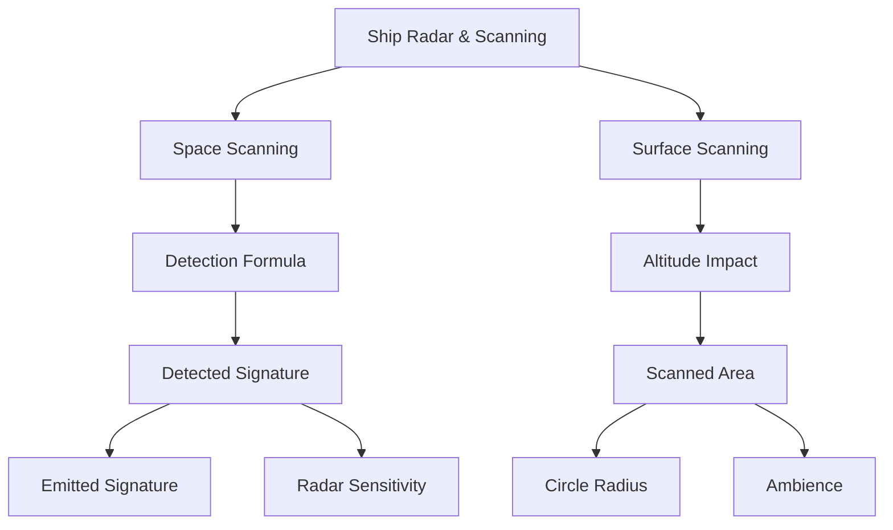
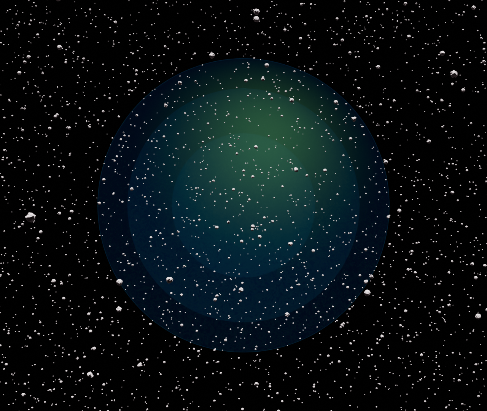
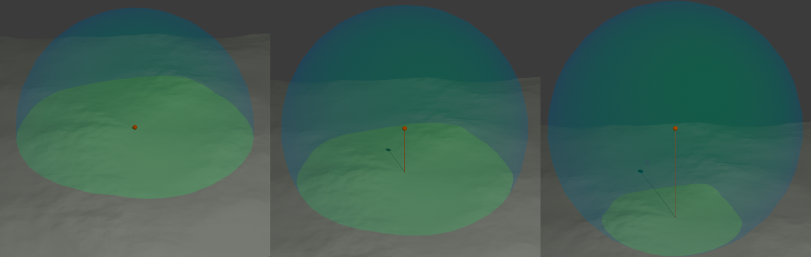

[💬 Send feedback on this page](https://github.com/codepic/StarCitizen.Mining.Mole/issues/new?template=feedback.yml&title=Feedback+on+RadarMechanics.md&page=RadarMechanics.md)  

# 3. Radar Mechanics and Resource Detection

> **Summary:** This guide explores the mechanics of ship radar and scanning in Star Citizen, focusing on resource detection techniques and radar formulas. It provides practical insights for players aiming to improve their mining and exploration efficiency.

> **Geek-Out Warning:** This guide dives into the nitty-gritty of radar formulas and scanning techniques. But don't worry—it's all grounded in common sense, so even if math isn't your thing, you'll find it easy to follow and super rewarding!

> **Quick Note:** Even if mining isn't your thing and you're more into the pew-pew action, you might actually learn something useful here. After all, understanding radar mechanics can give you an edge in any scenario!

---

## 3.1 Mandatory Graph

> **Summary:** A visual representation of radar and scanning concepts, illustrating their interconnections and key topics covered in the guide.

## 3.2 Why This Guide Matters

If you've ever struggled to find rocks, salvage, or other resources while mining or exploring in Star Citizen, you're not alone! Many players miss out on valuable finds simply because they don't fully understand how ship radar and scanning work. This guide is here to help you change that.

Before we dive into the technical details, let's set the stage with what you'll gain from this guide:

**What You'll Learn:**
- **Choosing the Right Ship:** Some ships, like the Reclaimer, can only detect a small fraction of resources compared to others like the Dragonfly. Using the right ship makes a huge difference!
- **Understanding Radar Specs:** Even similar-looking ships can have very different radar sensitivity. For example, the MSR can scan 10% more space than a MOLE, just because of its radar.
- **Space vs. Surface Scanning:** The area or volume you can scan changes dramatically depending on whether you're in space or on a planet. Knowing the difference helps you plan your search and avoid frustration.
- **No More Guesswork:** With the formulas and tables in this guide, you'll know exactly what your ship can (and can't) do. This means less time wandering and more time finding valuable resources.
- **Confidence and Efficiency:** Understanding these basics will make you a more effective miner, scout, or salvager—and make your time in the 'verse much more rewarding!

**Bottom line:** Whether you're a seasoned veteran or just starting your journey, this guide will help you make the most of your radar and scanning techniques, ensuring you never miss a valuable find again!

---

## 3.3 Signal Detection Mechanics: Breaking Down the Radar Formula

Ready to geek out? Here's where we dive into the mechanics of detection. Don't worry if formulas aren't your thing—we'll break them down step by step and show you how they apply in real scenarios.

To know if your ship can detect a resource, use this formula:

> **DetectedSignature = (EmittedSignature - (Ambience × (1 - RadarPierce))) × RadarSensitivity**

> **Units Note:** Both `DetectedSignature` and `EmittedSignature` are measured in meters (m). These values represent the maximum distance at which a radar can detect a target's signal.

But in space, ambience is zero, so it simplifies to:

> **DetectedSignature = EmittedSignature × RadarSensitivity**

This means that in space, only the emitted signature of the target and your radar's sensitivity matter for detection—radar pierce and ambience have no effect in a true vacuum. This has been confirmed through experimentation in the [Aaron-Halo asteroid belt](https://cstone.space/resources/knowledge-base/65-aaron-halo-detailed-shape-and-density-survey), where detection results matched the simplified formula and showed no influence from radar pierce or ambience.

If **DetectedSignature ≥ DistanceToTarget**, you will see the target on radar or ping. In other words, if your radar's effective detection power reaches the target, it's revealed.

**Source:** [CIG Dev Formula](https://robertsspaceindustries.com/spectrum/community/SC/forum/50259/thread/what-do-the-numbers-on-right-of-hud-ir-cs-em-value/4685582)

## 3.4 Radar Parameters Explained

This section explains the variables and parameters in the detection formula, so you know what each one means and why it matters.

### 3.4.1 EmittedSignature
The signal strength emitted by the target (e.g., asteroid, salvage panel). Based on individual surveys, a value of 20,000 meters is accurate for asteroids and salvage panels.

### 3.4.2 Ambience
Determines the focus or width of the scanning cone. It has no impact in space due to zero ambience. More research is needed to figure out the actual values of Ambience on planetary body surfaces. If figuring out such details is your suit, consider applying for the Cornerstone Star Citizen organization and its `analysis` pillar. Learn more and join at [Cornerstone Organization](https://robertsspaceindustries.com/en/orgs/CSTONE).

### 3.4.3 RadarPierce
The angle of the radar scan, determining how focused or wide the scanning cone is. According to the formula provided by CIG developers, if Ambience = 0, RadarPierce is effectively canceled out and has no impact on DetectedSignature.

### 3.4.4 RadarSensitivity
Effectively the percentage of the maximum 20 kilometers your radar can detect a signature in vacuum.

### 3.4.5 Example: Ship Radar Sensitivity

In vacuum, the scanned volume increases by the cube of the radius. This means RS Signature sensitivity has a huge impact on scanning results, as even small increases in sensitivity can lead to significantly larger scanned volumes.

> **Image:** The image illustrates the relative scanned volumes of different ships. The largest bubble represents the Dragonfly, which has the highest RS Signature sensitivity and detection range, resulting in the largest scanned volume. The second largest bubble corresponds to the MOLE, showcasing its moderate sensitivity and range. The smallest bubble represents the Reclaimer, which has the lowest sensitivity and detection range, leading to the smallest scanned volume.

The following table shows how much space different ships can scan in vacuum. The higher the sensitivity, the more resources you can find!

| Ship Name         | RS Sensitivity (%) | Detection Range (m) | Scanned Volume (km³) | % of Max Volume |
|-------------------|-------------------|---------------------|----------------------|-----------------|
| Dragonfly         | 100%              | 20,000              | 33,510               | 100%            |
| Mantis            | 90%               | 18,000              | 24,429               | 73%             |
| MSR               | 85%               | 17,000              | 20,579               | 61%             |
| MOLE              | 80%               | 16,000              | 17,157               | 51%             |
| Vulture           | 80%               | 16,000              | 17,157               | 51%             |
| Prospector        | 80%               | 16,000              | 17,157               | 51%             |
| Carrack           | 75%               | 15,000              | 14,137               | 42%             |
| Reclaimer         | 50%               | 10,000              | 4,189                | 13%             |

> **Note:** Detection range is calculated as EmittedSignature × RS Sensitivity. Scanned volume is calculated as 4/3 × π × (DetectionRange/1000)³.

> *Sorry Reclaimer fans, I don’t make the rules—your radar just snoozes. Maybe it’s dreaming of a better patch!*

> 💡 **Tip:** Clusters of rocks will show a higher RS value on your HUD. If you notice a sudden jump in RS signature while scanning, it often means you've found a rich area with multiple deposits close together. Focus your search in these spots for the best mining opportunities.
> 
> 💡 **Tip:** Adjust your ship's speed while scanning—flying slower increases your chances of detecting smaller or more distant rocks, as it gives your radar more time to pick up faint signals.
>
> 💡 **Tip:** Use slow, overlapping scan passes when covering an area. This helps ensure you don't miss small deposits that might fall between scan sweeps, especially when searching for valuable or rare resources.

### 3.4.6 Example: Surface Scanning

When scanning on a planet or moon, detection is limited to a 2D area (a circle) instead of a 3D volume. The scanned area is:

> **Area (km²) = π × (DetectionRange/1000)²**

> **Assumption:** This example assumes an altitude of 0 meters.

| Ship Name   | RS Sensitivity (%) | Detection Range (m) | Scanned Area (km²) | % of Max Area |
|-------------|-------------------|---------------------|--------------------|---------------|
| Dragonfly   | 100%              | 20,000              | 1,257              | 100%          |
| Mantis      | 90%               | 18,000              | 1,018              | 81%           |
| MSR         | 85%               | 17,000              | 908                | 72%           |
| MOLE        | 80%               | 16,000              | 804                | 64%           |
| Vulture     | 80%               | 16,000              | 804                | 64%           |
| Prospector  | 80%               | 16,000              | 804                | 64%           |
| Carrack     | 75%               | 15,000              | 707                | 56%           |
| Reclaimer   | 50%               | 10,000              | 314                | 25%           |

> **Note:** Scanned area is calculated as π × (DetectionRange/1000)².

## 3.5 How Much Can You Scan? (Effective Scanning Volume)

The farther your radar can detect, the more space you can scan. The formula is:

> **Volume (km³) = 4/3 × π × (DetectedSignature / 1000)³**

Even a small increase in detection range means a much larger increase in the volume you can scan!

**Example:**
- Reclaimer (RadarSensitivity = 50%) detects at ~10 km → ~4,189 km³ scanned
- Dragonfly (RadarSensitivity = 100%) detects at ~20 km → ~33,510 km³ scanned
- The Reclaimer scans about 12.5% of the volume that the Dragonfly can, which explains why you can't find much panels with a Reclaimer.

## 3.6 How to Use Your Radar (Practical Steps)

1. **Know Your Ship's Specs:** Learn your ship's RS Signature Sensitivity and calculate its detection range and scanned volume.
2. **Plan Your Route:** When exploring or mining, plan your route to maximize radar coverage. Consider your ship's radar limitations.
3. **Adjust Your Speed:** Slower speeds allow for more accurate scanning and less missed resources. Balance speed and detection.
4. **Use Ping Wisely:** Use the ping function to quickly check for resources nearby. Remember the difference between space and surface pinging.
5. **Analyze Readings:** Learn to quickly interpret radar or ping readings to find the location and quantity of resources.
6. **Practice Makes Perfect:** The more you use and understand your ship's radar, the better you'll get at finding resources.

## 3.7 Surface Scanning vs. Altitude

### 3.7.1 Understanding Surface Scanning

When scanning for resources on a planet or moon, the scanned area forms a circular intersection between the radar's spherical detection range and the surface. As altitude increases, the radius of this circle decreases, reducing the scanned area.

> **Image:** This chart visualizes how your scanned area shrinks as you gain altitude above a planet or moon. The largest circle (at ground level) shows the maximum area you can scan in a single pass. As you climb higher, the intersection between your radar's detection sphere and the surface gets smaller—meaning you cover less ground with each scan. This is why low-altitude, overlapping passes are key for thorough surface prospecting. If you’re flying high and missing rocks, now you know why! (And yes, the math really does matter here.)

### 3.7.2 Surface Scanning Area Table

Below is a table illustrating how the scanned surface area changes with altitude for a ship with a maximum scanning radius of 20,000 meters (100% RS Signature Sensitivity) and 17,000 meters (85% RS Signature Sensitivity):

| Altitude (h) in m | Circle Radius √(r² - h²) (m) (100%) | Scanned Area (km²) (100%) | Circle Radius √(r² - h²) (m) (85%) | Scanned Area (km²) (85%) |
|-------------------|------------------------------------|---------------------------|------------------------------------|--------------------------|
| 0                 | 20,000                            | 1,256.6                   | 17,000                            | 907.9                    |
| 2,000             | 19,798                            | 1,229.2                   | 16,798                            | 884.7                    |
| 4,000             | 19,595                            | 1,173.4                   | 16,595                            | 859.7                    |
| 6,000             | 19,390                            | 1,089.1                   | 16,390                            | 832.9                    |
| 8,000             | 19,183                            | 976.2                     | 16,183                            | 804.3                    |
| 10,000            | 18,974                            | 834.5                     | 15,974                            | 774.0                    |
| 12,000            | 18,788                            | 663.5                     | 15,788                            | 742.0                    |
| 14,000            | 18,520                            | 462.4                     | 15,520                            | 708.2                    |
| 16,000            | 18,330                            | 230.4                     | 15,330                            | 672.7                    |
| 18,000            | 8,717                             | 23.9                      | 7,717                             | 187.0                    |
| 20,000            | 0                                 | 0                         | 0                                 | 0                        |

> 💡 **Tip:** The scanned area is calculated using the formula **π × (r² - h²)**, where `r` is the radar's maximum scanning radius and `h` is the altitude above the surface.

> ✅ **Key Point:** The table assumes RS Signature Sensitivity of 100% and 85%, which represent theoretical and practical values respectively.

> ⚠️ **Caution:** The calculations assume Ambience=0, which is never true on a planet's surface.

## 3.8 Key Takeaways
- ✅ **Radar Sensitivity is Critical:** Higher sensitivity means more resources detected at greater distances.
- 💡 **Ambience is Zero in Space:** RadarPierce does not affect resource detection in vacuum.
- ✅ **Detection is Binary:** If DetectedSignature ≥ DistanceToTarget, you see the resource; otherwise, you don't.
- 💡 **Volume Scales Fast:** Small improvements in detection range yield much larger scanning volumes.

## 3.9 Simple Rules Summary

1. The scanned volume increases by the cube of the radius.
2. The scanned surface area at 0 altitude increases by the square of the radius.
3. The scanned surface area decreases by the square of the altitude.

---

## 3.10 References & Further Reading

- [CIG Dev Formula Discussion](https://robertsspaceindustries.com/spectrum/community/SC/forum/50259/thread/what-do-the-numbers-on-right-of-hud-ir-cs-em-value/4685582) — Official developer discussion explaining the meaning and mechanics behind HUD IR/CS/EM values and the detection formula in Star Citizen.
- [SC Ships Performances Viewer (RS Sensitivity)](https://www.spviewer.eu/performance?ship=drak_vulture) — Community-maintained tool for comparing ship radar sensitivity, detection ranges, and other performance metrics for all ships in Star Citizen.
- [Aaron Halo - Detailed Shape and Density Survey (CaptSheppard, Cornerstone)](https://cstone.space/resources/knowledge-base/65-aaron-halo-detailed-shape-and-density-survey) — A comprehensive, scientific survey of the Aaron-Halo asteroid belt by CaptSheppard (Cornerstone). This article details the methods, data, and findings on the belt's structure, density, and consistency across servers, and stands as a gold standard for community-driven research. CaptSheppard's marvellous work not only advanced our understanding of the Aaron-Halo, but also inspired me to join Cornerstone and later create this documentation.
- [Regolith Rocks Rock Class Survey](https://regolith.rocks/survey/rock_class) — A detailed, community-driven database of RS signature values for all rock and deposit types in Star Citizen. This resource is invaluable for identifying scanned objects and understanding the numbers shown on your ship's HUD.
