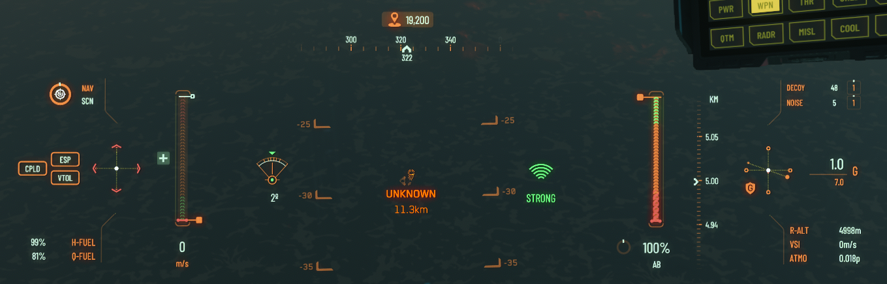

[💬 Send feedback on this page](https://github.com/codepic/StarCitizen.Mining.Mole/issues/new?template=feedback.yml&title=Feedback+on+ResourceScanning.md&page=ResourceScanning.md)  

# 4. Scanning for Resources

## 4.1 Introduction

A significant portion of this document's contents revolves around radar mechanics and resource detection algorithms. To gain a deeper understanding of these topics, it is highly recommended to familiarize yourself with the concepts outlined in the [Radar Mechanics and Resource Detection guide](RadarMechanics.md). This guide delves into ship radar mechanics, scanning techniques, and detection formulas, providing practical insights to enhance mining and exploration efficiency.

While the `RadarMechanics.md` guide dives deeper into the underlying technology and theoretical aspects, this document focuses on practical advice for leveraging that technology to your advantage during resource scanning and mining operations.

## 4.2 Identifying Deposit Types from Kilometers Away 🚀 *New in 4.2.0*

To effectively identify resource types without moving to them, follow this procedure:

1. Ensure your altitude is between 3-5 km for optimal scanning results.
2. Switch to `NAV SCN` mode (Keyboard: V).
3. Widen the angle of your radar to 90% (Mouse: Wheel).
4. Initiate radar ping (Keyboard: Tab).
5. Point your ship towards a detected signature and ensure as high signal strength as possible.

   

6. Narrow down the radar angle to 2% while maintaining signal strenth

   

7. Initiate another radar ping (Keyboard: Tab).
8. Realign your ship to the target, ensuring maximal signal strength.
9.  Hold Left Mouse Button until you see the deposit type.

   

## Asteroid Scanning
- How to Scan Asteroid Fields Effectively
- Best Locations for Profitable Asteroid Mining
- Interpreting Scan Results (Mass, Composition, Value)

## Surface Scanning

- Scanning Techniques for Planetary Surfaces
- Understanding RS Signatures and Rock Clusters
- Recommended Tools and Vehicles (ROC, Prospector)

## 4.1 RS Signature Values by Resource Type

Each minable resource type in Star Citizen has its own Radar Signature (RS) value, which determines how detectable it is by your ship's radar. For example, a Granite Deposit has an RS signature of 1920, while a Hercules C2 Derelict ship has a signature of 2400. The RS signature you see on your ship's HUD may be a multiple of the base value, depending on how many of that resource are clustered together—e.g., 1920 for a single granite deposit, 3840 for two, 5760 for three, and so on.

> **Note:** RS signature detection works exactly the same way as IR, EM, or CS detection. The only difference is that RS values for resources are static (always the same for a given resource type), while ship signatures (IR/EM/CS) are dynamic and can change depending on what modules are active, ship state, or player actions.

For a comprehensive and up-to-date list of RS signature values for all minable resource types, see the [Regolith Rocks Rock Class Survey](https://regolith.rocks/survey/rock_class). If you hover your mouse over the RS signature on the linked page, you'll see the multiple signature values for each resource type.

### Common RS Signature Values for Minable Resource Types

Below are example RS signature values for common minable rocks and surface deposits. The value you see on your ship's HUD is the sum of all signatures in a cluster—e.g., 1920 for one Granite Deposit, 3840 for two, etc.

| Resource Type         | RS Signature (2) | RS Signature (3) | RS Signature (5) | RS Signature (7) | RS Signature (11) |
|----------------------|------------------|------------------|------------------|------------------|-------------------|
| Granite Deposit      | 3840             | 5760             | 9600             | 13,440           | 21,120            |
| Igneous Deposit      | 3900             | 5850             | 9750             | 13,650           | 21,450            |
| Quartzite Deposit    | 3640             | 5460             | 9100             | 12,740           | 19,880            |
| Shale Deposit        | 3460             | 5190             | 8650             | 12,110           | 18,830            |
| Atacamite Deposit    | 3600             | 5400             | 9000             | 12,600           | 19,800            |
| Felsic Deposit       | 3540             | 5310             | 8850             | 12,390           | 19,470            |
| Gneiss Deposit       | 3680             | 5520             | 9200             | 12,880           | 20,240            |
| Obsidian Deposit     | 3580             | 5370             | 8950             | 12,530           | 19,690            |
| Hercules C2 Derelict | 4800             | 7200             | 12,000           | 16,800           | 26,400            |

#### Example: Signature Multiples

If you scan a cluster of 3 Granite Deposits, the HUD will show:

| Number of Granite Deposits | Total RS Signature |
|---------------------------|--------------------|
| 1                         | 1920               |
| 2                         | 3840               |
| 3                         | 5760               |
| 5                         | 9600               |
| 7                         | 13,440             |
| 11                        | 21,120             |

This pattern applies to all minable resource types: simply multiply the base RS signature by the number of rocks or deposits in the cluster.

For a full and up-to-date list, see the [Regolith Rocks Rock Class Survey](https://regolith.rocks/survey/rock_class). If you hover your mouse over the RS signature on the linked page, you'll see the multiple signature values for each resource type.

---

## 4.2 Ship Minables vs. ROC/FPS Minables

### 4.2.1 Understanding the Difference

Ship minables and ROC/FPS minables differ significantly in their `EmittedSignature` values. ROC/FPS minables generally have lower `EmittedSignature` values, making them harder to detect at longer ranges. This distinction is crucial when surface scanning for resources.

### 4.2.2 Practical Insight

If you discover a deposit while surface scanning at a range of less than 5 km, it is most likely one of the following ROC/FPS minables:

- Janalite
- Hadanite
- Feynmeline
- Aphorite
- Beradom
- Dolivine
- Glacosite
- Carinite
- Jaclium
- Saldynium

> **Note:** These minables are typically smaller and have lower `RS Signature` values compared to ship minables, which are detectable at much greater distances.

---

## 4.3 Related Guides

- For MOLE ship setup and turret loadouts, see [Base Setup](BaseSetup.md)
- For mining location strategies and ore property tables, see [Mining Location Selection](MiningLocation.md)
- For radar mechanics, detection formulas, and scanning tips, see [Radar Mechanics and Resource Detection](RadarMechanics.md)
- For ore cutoff policies and evaluation math, see [Ore Cutoff Percentages & Rock Evaluation](OreCutoff.md)

