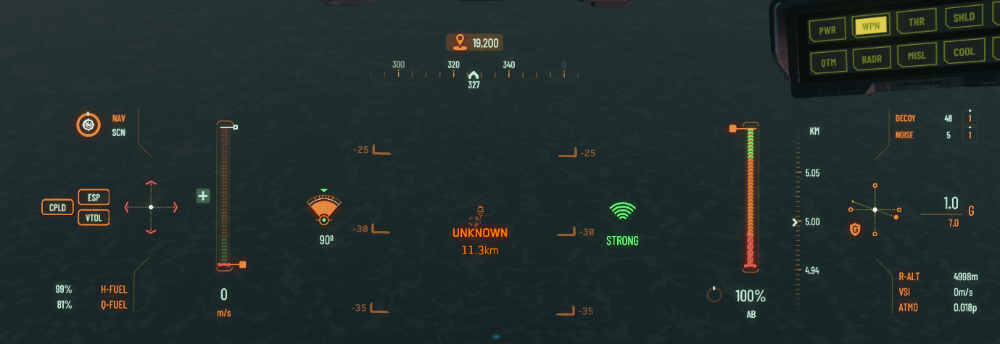

[💬 Send feedback on this page](https://github.com/codepic/StarCitizen.Mining.Mole/issues/new?template=feedback.yml&title=Feedback+on+ResourceScanning.md&page=ResourceScanning.md)  

# 4. Scanning for Resources

## 4.1 Introduction

Both this guide and the [Radar Mechanics and Resource Detection guide](RadarMechanics.md) cover similar concepts, but with different aims. If you want technical details—how the radar system works, the math behind detection, and a focus on spherical pinging—`RadarMechanics.md` is the reference. This document, on the other hand, is about practical, field-tested advice for resource detection: straightforward tips, scanning strategies, and ways to improve your mining efficiency without unnecessary complexity.

> **Curious about the difference between radar detection, ping, and scanning?** Check out [3.2.1 Radar Detection, Ping, and Scanning: The Three Detection Modes](RadarMechanics.md#321-radar-detection-ping-and-scanning-the-three-detection-modes) for a quick primer.

This guide is focused on actionable advice—how to use your ship’s radar to find, identify, and evaluate resources with confidence. Let's get started!

## 4.1.1 Ping Cone Shape, SCN Mode, and Real-World Radar Behavior

> **Observation:** Radar ping behavior in-game is more nuanced than the simple 360° sphere described in technical guides. Understanding these differences can help you scan more effectively.

### 4.1.1.1 360° Spherical Ping: The True Default

- **Default Behavior:** When you ping outside of Scan (`SCN`) mode, your radar pulse is always a sphere—a 360° bubble that covers everything around you, regardless of your angle setting. The angle wheel has no effect unless you’re in SCN mode.
- **SCN Mode at 90°:** In SCN mode, if your angle is set to exactly 90°, your ping is still a sphere (360° coverage). This has been observed in Star Citizen 3.2.0 and may be a bug or an undocumented feature. For a true cone, set your angle to less than 90%.
- **Practical Example:** In NAV or SCM mode, pressing `Tab` always gives you a full-coverage ping. In SCN mode, leaving the angle at 90% produces the same result.

### 4.1.1.2 The Focused Cone: SCN Mode and Narrow Angles

- **SCN Mode:** Enter SCN mode and reduce your ping angle below 90%. Your radar ping becomes a focused cone, allowing you to concentrate on a specific area and increase signal strength in that direction.
- **Practical Example:** If you notice a faint signature, switch to SCN mode, narrow your angle to 2%, and ping. This focuses your radar on a small area ahead.

### 4.1.1.3 Visualizing the Focused Cone: Advanced HUD and Ping Angle

With the angle set to 45% in SCN mode, much of the area is excluded from the ping. The difference between 90° and 45% is significant: at 90°, your ping really covers a sphere around you; at 45°, it covers only a narrow slice in front of you. This can be surprising if you expect a gradual change.

> **Tip:** If you have Advanced HUD enabled, the edge of your HUD display lines up with the edge of your 45° ping cone. This can help you estimate your coverage area more accurately.

### 4.1.1.4 Best Practice: Only Use Focused Ping When Honing In

> **Recommendation:** Unless you are focusing on an already detected signature, avoid using focused radar ping (SCN mode with angle < 90%). For general searching, stay in `SCM` or `NAV` mode and avoid SCN mode. This ensures maximum area coverage and consistent ping results. Use focused pings only when you need to analyze or confirm a specific target.

### 4.1.1.5 What Happens If...
- **You try to narrow the angle outside SCN mode?** The angle setting is ignored; your ping remains a 360° sphere.
- **You forget to switch back to NAV/SCM after a focused scan?** Your next ping in NAV or SCM mode will be full coverage, even if the angle was left at 2%.
- **You set your angle to 90% in SCN mode?** Your ping is still a sphere. For a true cone, use less than 90%.

### 4.1.1.6 Why Does This Matter?
- **Efficiency:** Use the 360° ping for broad sweeps, then switch to SCN mode and narrow your angle for more precise work when needed.
- **Stealth:** Focused pings in SCN mode are less likely to be noticed by others (needs field testing).
- **Resource Hunting:** Understanding the difference helps you find clusters efficiently and focus on the best rocks without unnecessary effort.

> **Summary:** For general searching, use NAV or SCM mode for maximum detection. Use focused ping (SCN mode, angle < 90%) only when honing in on a specific, already detected signature. Outside SCN mode, your ping is always a 360° sphere. In SCN mode, your ping is also a sphere if the angle is set to 90%. Only with an angle less than 90% does your ping become a focused cone.

## 4.2 Identifying Deposit Types from Kilometers Away 🚀 *New in 4.2.0*

With the right scanning technique, you can identify resource types from kilometers away and plan your mining runs more efficiently.

To identify resources at a distance, follow this procedure:

1. Fly at an altitude between 3–5 km for optimal scanning area.
2. Switch to `NAV SCN` mode (Keyboard: V).
3. Widen your radar cone angle to 90% (Mouse: Wheel).
4. Initiate a ping (Keyboard: Tab).
5. If you see a shrubbery on your radar, you may have wandered into the wrong guide.
6. Point your ship toward a detected signature and maximize signal strength.

   

7. Narrow the radar ping angle to 2% while maintaining signal strength.

   

8. Ping again (Keyboard: Tab).
9. Realign your ship to the target, ensuring maximal signal strength.
10. Hold Left Mouse Button to scan until you see the deposit type.

   

## 4.3 Asteroid Scanning
- How to Scan Asteroid Fields Effectively
- Best Locations for Profitable Asteroid Mining
- Interpreting Scan Results (Mass, Composition, Value)

## 4.4 Surface Scanning
- Scanning Techniques for Planetary Surfaces
- Understanding RS Signatures and Rock Clusters
- Recommended Tools and Vehicles (ROC, Prospector)

## 4.5 RS Signature Values by Resource Type

Every minable resource in Star Citizen has its own Radar Signature (RS) value, which determines how easily it’s detected by your ship’s radar. For example, a Granite Deposit has an RS signature of 1920, while a Hercules C2 Derelict ship clocks in at 2400. The RS signature you see on your HUD may be a multiple of the base value, depending on how many of that resource are clustered together—e.g., 1920 for a single granite deposit, 3840 for two, 5760 for three, and so on.

For a comprehensive and up-to-date list of RS signature values for all minable resource types, see the [Regolith Rocks Rock Class Survey](https://regolith.rocks/survey/rock_class). Hover your mouse over the RS signature on the linked page to see multiple signature values for each resource type.

### 4.5.1 Common RS Signature Values for Minable Resource Types

Below are example RS signature values for common minable rocks and surface deposits. The value you see on your HUD is the sum of all signatures in a cluster—e.g., 1920 for one Granite Deposit, 3840 for two, etc.

| Resource Type         | RS Signature (2) | RS Signature (3) | RS Signature (5) | RS Signature (7) | RS Signature (11) |
|----------------------|------------------|------------------|------------------|------------------|-------------------|
| Granite Deposit      | 3840             | 5760             | 9600             | 13,440           | 21,120            |
| Igneous Deposit      | 3900             | 5850             | 9750             | 13,650           | 21,450            |
| Quartzite Deposit    | 3640             | 5460             | 9100             | 12,740           | 19,880            |
| Shale Deposit        | 3460             | 5190             | 8650             | 12,110           | 18,830            |
| Atacamite Deposit    | 3600             | 5400             | 9000             | 12,600           | 19,800            |
| Felsic Deposit       | 3540             | 5310             | 8850             | 12,390           | 19,470            |
| Gneiss Deposit       | 3680             | 5520             | 9200             | 12,880           | 20,240            |
| Obsidian Deposit     | 3580             | 5370             | 8950             | 12,530           | 19,690            |
| Hercules C2 Derelict | 4800             | 7200             | 12,000           | 16,800           | 26,400            |

#### 4.5.1.1 Example: Signature Multiples

If you scan a cluster of 3 Granite Deposits, the HUD will show:

| Number of Granite Deposits | Total RS Signature |
|---------------------------|--------------------|
| 1                         | 1920               |
| 2                         | 3840               |
| 3                         | 5760               |
| 5                         | 9600               |
| 7                         | 13,440             |
| 11                        | 21,120             |

This pattern applies to all minable resource types: multiply the base RS signature by the number of rocks or deposits in the cluster.

For a full and up-to-date list, see the [Regolith Rocks Rock Class Survey](https://regolith.rocks/survey/rock_class). Hover your mouse over the RS signature on the linked page to see the multiple signature values for each resource type.

---

## 4.6 Ship Minables vs. ROC/FPS Minables

### 4.6.1 Understanding the Difference

Ship minables and ROC/FPS minables differ in their `EmittedSignature` values. ROC/FPS minables generally have lower values, making them harder to detect at longer ranges. This distinction is important when surface scanning for resources.

### 4.6.2 Practical Insight

If you discover a deposit while surface scanning at a range of less than 5 km, it is most likely one of the following ROC/FPS minables:

- Janalite
- Hadanite
- Feynmeline
- Aphorite
- Beradom
- Dolivine
- Glacosite
- Carinite
- Jaclium
- Saldynium

> **Note:** These minables are typically smaller and have lower `RS Signature` values compared to ship minables, which are detectable at much greater distances.

---

## 4.7 References & Further Reading

- [Regolith Rocks Rock Class Survey](https://regolith.rocks/survey/rock_class)
- [Star Citizen Mining Discords & Community Resources](ResourcesReferences.md)

---

## 4.8 Related Guides

- For MOLE ship setup and turret loadouts, see [Base Setup](BaseSetup.md)
- For mining location strategies and ore property tables, see [Mining Location Selection](MiningLocation.md)
- For radar mechanics, detection formulas, and scanning tips, see [Radar Mechanics and Resource Detection](RadarMechanics.md)
- For ore cutoff policies and evaluation math, see [Ore Cutoff Percentages & Rock Evaluation](OreCutoff.md)

